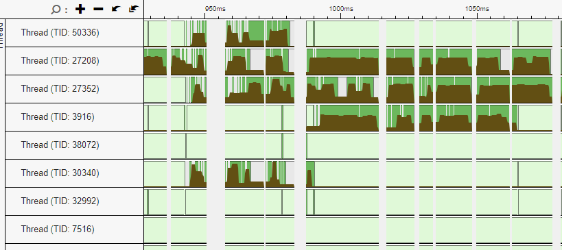
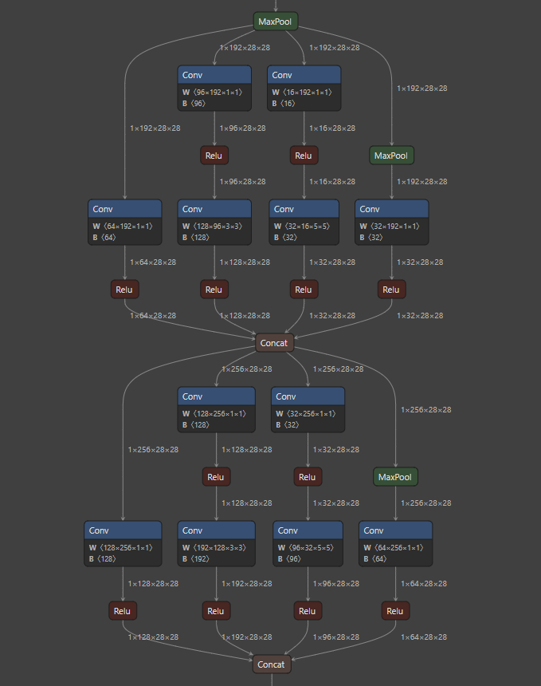

# Stonnx

## Preamble
This project is an ONNX interpreter written in Rust. It supports a subset of ONNX operators and types and it's able to execute a model in parallel.

It was developed by @Atari2 and @ClaudiuTcaciuc as a project for the course of "Programmazione di Sistema" (systems programming) at Politecnico di Torino during the academic year 2023/2024. 

Since the course was taught in Italian, the following readme is also in Italian, however, the in-code documentation is in English.

### Main Contributors:

- [s317659 Rosiello Alessio](https://github.com/Atari2)
- [s317661 Tcaciuc Claudiu Constantin](https://github.com/ClaudiuTcaciuc)

## Nome

Il nome deriva dalla fusione di [Steelix](https://wiki.pokemoncentral.it/Steelix) (pokemon di metallo, scelto perchè il progetto è scritto in Rust) e ONNX. Inoltre è anche un gioco di parole con [stonks](https://www.icbz4.it/alunnifermi/wp-content/uploads/2019/12/significato-stonks-1024x766.jpg).

## Indice
1. [Descrizione progetto](#descrizione-progetto)
2. [Modalità di utilizzo](#modalità-di-utilizzo)
3. [Modelli supportati](#modelli-supportati)
4. [Crate più importanti utilizzate](#crate-più-importanti-utilizzate)
5. [Descrizione varie parti del progetto](#descrizione-varie-parti-del-progetto)
6. [Architettura del programma](#architettura-del-programma)
7. [Utilizzare Stonnx come libreria](#utilizzare-stonnx-come-libreria)

### Descrizione progetto:

Il progetto consiste nella realizzazione di un interprete ONNX utilizzando il linguaggio Rust. Le richieste da rispettare sono le seguenti:

- Creazione di un parser per estrarre dal file ONNX l'informazione necessaria per la creazione della rete;
- Implementazione di un sotto-set di operatori ONNX;
- Utilizzo di parallelismo per l'esecuzione della rete;
- (Opzionale) binding con altri linguaggi.

### Modalità di utilizzo:

- Scaricare i modelli ONNX utilizzando gli script `download_models.ps1` (windows) o `download_models.sh` (linux/macOS) presenti nella cartella `scripts` oppure scaricarli manualmente da [questo](https://www.atarismwc.com/models.tar.gz) ed estrarli nella root del repository. Originariamente i modelli erano stati inseriti nel repository utilizzando git-lfs ma questo ha causato problemi con il repository fornitoci dal politecnico in quanto la quota di spazio e banda disponibile era troppo bassa;

- Eseguire il comando `cargo build --release` per compilare il progetto;

  - di default il progetto viene compilato utilizzando il parallelismo con `rayon`, ma esiste anche [un'implementazione personale di ThreadPool](src/parallel/mod.rs), controllata da una feature flag `custom-threadpool`. Per compilare con il parallelismo da noi implementato utilizzare quindi il comando `cargo build --features custom-threadpool --release`.
  
    L'implementazione di ThreadPool da noi realizzata coesistente con quella di rayon è stata creata in questo modo per molteplici motivi:
    1. per dimostrare le nostre conoscenze nell'ambito del parallelismo in rust e delle sue applicazioni
    2. per confrontare la performance tra le due implementazioni, in modo da poter valutare quale sia la migliore e per verificare che la nostra implementazione non abbia problemi di performance e la sua correttezza. Dopo aver fatto molti benchmark con vari modelli, abbiamo effettivamente confermato che la nostra implementazione ha performance comparabile con quella di `rayon` e che fornisse risultati corretti e uguali.

- Eseguire il comando `cargo run --release -- --model <modelname>` oppure `cargo run --release --features custom-threadpool -- --model <modelname>`

  - `modelname` è il percorso alla cartella contenente il modello. Nel caso il percorso sia relativo, verrà assunto relativo a `$pwd/models` dove `$pwd` rappresenta la cartella in cui risiede l'eseguibile. Nella cartello contenente il modello ci dovrà essere un file `inputs.json` con il seguente schema:

    ```json
    {
        "inputs": [
            "<percorso verso input del modello>",
            ...
        ],
        "outputs": [
            "<percorso verso output attesi del modello>",
            ...
        ],
        "modelpath": "<percorso al file .onnx contenente il modello>"
    }
    ```

    tutti i percorsi all'interno di questo file possono essere relativi o assoluti, se relativi, saranno assunti relativi a `$pwd/models/$modelname`.

  - Dopo aver clonato il repository, ci saranno dei modelli non presenti all'interno della cartella `models`, questi verranno scaricati automaticamente da internet durante la prima build del progetto.

- Nel caso in cui si volesse visualizzare l'esecuzione degli operatori è possibile aggiungere l'opzione `--verbose` al comando precedente (di default verbose è 0).

  - Esempio: `cargo run --release -- --model <modelname> --verbose 1`
  - `verbose = 0`: non visualizza nulla
  - `verbose = 1`: visualizza informazioni riguardanti l'esecuzione degli operatori
  - `verbose = 2`: inserisce gli output di ogni operatore in un file `.npy`
  - `verbose = 4`: inserisce anche gli output intermedi di ogni operatore in un file `.npy`

- Un esempio di esecuzione del modello `googlenet` è la seguente: `cargo run --release --features custom-threadpool -- --verbose 0 --model googlenet-12`

- Inoltre può essere aggiunto il comando `--gengraph` per generare file che poi possono essere usati per disegnare grafi dei modelli. Il programma può generare il grafo in un formato proprietario `json` (che può essere letto da questo [tool](https://github.com/Atari2/ONNXGraphLayout)) oppure in generico formato `dot` (da usare con [graphviz](https://graphviz.org/)). Il formato del grafo può essere controllato dall'opzione `--graphtype` che può essere `json` o `dot` (default: `json`). Il file generato sarà posto nella stessa cartella in cui risiede il modello eseguito.

- Eseguire il comando `cargo doc --open` per visualizzare la documentazione del progetto.

### Modelli supportati:

> Questa sezione fa riferimento ai modelli del Model Zoo *prima* del revamp effettuato a Dicembre 2023, poichè lo sviluppo di questo programma è cominciato molto prima dell'aggiornamento del Model Zoo e quindi i modelli menzionati nei seguenti paragrafi sono quelli presenti nel vecchio Model Zoo, nello specifico, [questo commit](https://github.com/onnx/models/tree/5faef4c33eba0395177850e1e31c4a6a9e634c82).

Il programma supporta e completa l'esecuzione di circa ~70 modelli sui ~180 presenti nel vecchio Model Zoo, tuttavia per questioni di tempo e per evitare di dover scaricare tutti i modelli, abbiamo scelto di includere e testare a fondo soltanto alcuni di questi.

I modelli testati e con l'output correttamente confermato sono i seguenti:

- [AlexNet](https://github.com/onnx/models/tree/5faef4c33eba0395177850e1e31c4a6a9e634c82/vision/classification/alexnet)
- [MobileNet](https://github.com/onnx/models/tree/5faef4c33eba0395177850e1e31c4a6a9e634c82/vision/classification/mobilenet)
- [GoogleNet](https://github.com/onnx/models/tree/5faef4c33eba0395177850e1e31c4a6a9e634c82/vision/classification/inception_and_googlenet/googlenet)
- [ResNet](https://github.com/onnx/models/tree/5faef4c33eba0395177850e1e31c4a6a9e634c82/vision/classification/resnet)
- [GPT2](https://github.com/onnx/models/tree/5faef4c33eba0395177850e1e31c4a6a9e634c82/text/machine_comprehension/gpt-2)
- [Emotion](https://github.com/onnx/models/tree/5faef4c33eba0395177850e1e31c4a6a9e634c82/vision/body_analysis/emotion_ferplus)
- [CaffeNet](https://github.com/onnx/models/tree/5faef4c33eba0395177850e1e31c4a6a9e634c82/vision/classification/caffenet)
- [Inception](https://github.com/onnx/models/tree/5faef4c33eba0395177850e1e31c4a6a9e634c82/vision/classification/inception_and_googlenet/inception_v2)
- [Mnist](https://github.com/onnx/models/tree/5faef4c33eba0395177850e1e31c4a6a9e634c82/vision/classification/mnist)
- [SqueezeNet](https://github.com/onnx/models/tree/5faef4c33eba0395177850e1e31c4a6a9e634c82/vision/classification/squeezenet)
- [Shufflenet](https://github.com/onnx/models/tree/5faef4c33eba0395177850e1e31c4a6a9e634c82/vision/classification/shufflenet)
- [Super Resolution](https://github.com/onnx/models/tree/5faef4c33eba0395177850e1e31c4a6a9e634c82/vision/super_resolution/sub_pixel_cnn_2016)
- [VGG](https://github.com/onnx/models/tree/5faef4c33eba0395177850e1e31c4a6a9e634c82/vision/classification/vgg)
- [ZFNet](https://github.com/onnx/models/tree/5faef4c33eba0395177850e1e31c4a6a9e634c82/vision/classification/zfnet-512)

Nota: durante la scelta dei modelli è stato selezionata la versione più recente presente nel Model Zoo.

### Crate più importanti utilizzate:

Sono state utilizzate le seguenti crate:

- [ndarray](https://crates.io/crates/ndarray): utilizzato per la gestione degli array multidimensionali;
- [anyhow](https://crates.io/crates/anyhow): utilizzato per la gestione degli errori;
- [clap](https://crates.io/crates/clap): utilizzato per la gestione degli argomenti da linea di comando;
- [bytemuck](https://crates.io/crates/bytemuck): utilizzato per la conversione di tipi;
- [petgraph](https://crates.io/crates/petgraph): utilizzato per la creazione del grafo della rete;
- [serde](https://crates.io/crates/serde): utilizzato per la serializzazione e deserializzazione di strutture dati;
- [protobuf](https://crates.io/crates/protobuf): utilizzato per la gestione dei file protobuf;

### Descrizione varie parti del progetto:

- `src/main.rs`: file principale del progetto, contiene la funzione main e la gestione degli argomenti da linea di comando;
- `src/operators`: contiene i file con le implementazioni degli operatori ONNX;
  - tra gli operatori implementati si possono trovare (ma non solo): `Add`, `AveragePool`, `BatchNormalization`, `Concat`, `Conv`, `Dropout`, `Flatten`, `Gemm`, `GlobalAveragePool`, `MaxPool`, `MatMul`, `Mul`, `Relu`, `Reshape`, `Softmax`, `Sum`, `Transpose`;
- `src/onnxparser`: contiene i file con l'implementazione del parser per estrarre le informazioni dal file ONNX;

  - I file in questa cartella vengono generati a tempo di build (vedere `build.rs`) dal compilatore di protobuf utilizzando la libreria `protobuf_codegen`.

- `src/executor`: contiene l'implementazione per l'esecuzione della rete, sono presenti:
  - logica per la creazione del grafo e l'esecuzione degli operatori;
  - logica per la creazione di un pool di thread (personalizzato o utilizzando la libreria `rayon`) e la gestione della comunicazione tra i thread;
  - logica per il confronto degli output attesi con quelli ottenuti;
- `src/parallel`: contiene i file per l'implementazione del parallelismo con threadpool;
  - Il parallelismo è implmentato in due modi diversi:
    - utilizzando la libreria `rayon` (di default);
    - utilizzando un thread pool custom (attivabile con il flag `--features custom-threadpool`);
- `src/protograph`: contiene i file per l'implementazione della creazione di un file `.json` contenente il grafo della rete;
- `src/protos`: contiene il file `onnx.proto` utilizzato per la creazione del file `.rs` contenente le strutture dati per la gestione dei file protobuf;
- `src/common/mod.rs`: contiene le strutture dati utilizzate per la gestione dei file ONNX;
  - gestione del `verbose`;
  - gestione delle path per i file input e output dei vari modelli;
  - gestione dei file `.json` contenenti il grafo della rete;
  - gestione del `opset_version` degli operatori;
  - gestione dei risultati ottenuti dall'esecuzione di un operatore;
  - gestione dei tipi di dato;
  - gestione di un tratto per la rappresentazione dei tensori (`ArrayElement`);
  - gestione della lettura dei dati da formato binario, per la creazione dei tensori;
- `src/utils`: gestione di operazioni utili per la creazione dei tensori e la gestione di questi ultimi;
  - Sono presenti tra le varie cose funzioni per la creazione di file .npy contenenti i tensori durante l'esecuzione della rete, se il verbose è impostato a valori sopra lo 0;
  - Sono presenti anche funzioni per la creazione di tensori a partire shape e tipo di dato oppure shape, byte e tipo di dato;
  - Sono presenti anche funzioni per la creazione di tensori di input e output a partire dalla descrizione del modello;

### Architettura del programma:

Il programma ha quattro step principali:

- Parsing e lettura del file .onnx, dei suoi input provenienti dall'esterno e inizializzazione dei tensori iniziali con questi ultimi.
- Creazione di 2 grafi, rappresentati da due HashMap, uno che connette ogni operatore ai suoi input e uno che connette ogni input (tensore) agli operatori in cui viene usato, praticamente l'inverso del primo. Avere queste due rappresentazioni ci permette quindi di avere un grafo delle dipendenze di ciascun operatore, che verrà poi usato nell'esecuzione del modello stesso. Infatti, quando un operatore avrà soddisfatto tutte le sue dipendenze (e.g. i suoi input verranno prodotti da un operatore precedente), esso potrà essere messo in coda per l'esecuzione nel thread pool.
- Esecuzione dell'inferenza: il modello viene eseguito in parallelo, partendo dagli operatori che non hanno dipendenze o che hanno dipendenze già completamente soddisfatte, questi verranno messi in coda nel thread pool, ogni volta che un operatore viene portato a termine, il risultato di quest'ultimo verrà comunicato al thread principale che aggiornerà il grafo delle dipendenze e farà partire gli operatori che grazie a questo risultato hanno soddisfatto ora le loro dipendenze e così via, finchè il grafo delle dipendenze non sarà vuoto, e avremo quindi ottenuto il risultato finale.
- Implementazione del _thread pool_: La struttura principale che rappresenta il thread pool è composta da una `queue` (una coda sincronizzata per la gestione dei compiti), `workers` (una collezione di thread) e una `queuestate`(un contatore per tracciare il numero di operazioni in coda);
  - Quando un thread viene creato, esso inizia a ciclare in attesa di un'operazione da eseguire, quando un'operazione diventa disponibile perché le sue dipendenze sono state risolte, il thread che la aggiunge, notifica la queue dei workers tramite una `Condvar`, di conseguenza, uno dei thread liberi prende l'operazione e la esegue, quando questa viene completata, il thread notifica il thread principale che il compito è stato eseguito, il thread principale aggiorna il grafo delle dipendenze e aggiunge alla coda le operazioni che ora possono essere eseguiti, e così via, finchè non ci sono più compiti da eseguire;
  - Il codice utilizza `Mutex` e `Condvar` per l'accesso sincronizzato alla coda e per la comunicazione tra i thread;
  - Per quanto riguarda il parallelismo all'interno degli operatori, questo è stato implementato solo in alcuni operatori (dove si è ritenuto più conveniente, così da non appesantire l'esecuzione del programma nel caso di calcoli molto semplici e veloci con la gestione dei vari lock, e context switch tra i vari thread), in particolare, tra questi si può trovare `Conv`, `Exp`, `Sqrt`, `Pow`, `MaxPool`, `AveragePool` ma non solo. In particolare il parallelismo è stato introdotto nei punti dove vengono eseguiti loop molto pesanti, come ad esempio il calcolo della convoluzione, all'interno degli operatori, invece che usare il ThreadPool scritto da noi, viene utilizzata principalmente la feature di rayon degli iteratori paralleli;
- I seguenti screenshot mostrano esempi d'uso dei thread in parallelo (ottenuti con VTune), associato alla porzione del grafico eseguito in quel lasso di tempo (ottenuto con Netron):
#### Googlenet



#### Inception


- Comparazione degli output: il programma legge inoltre anche gli output "di reference" che dovrebbero essere ottenuti dall'esecuzione del modello e li confronta con quelli effettivamente ottenuti, controllando che la differenza tra i singoli valori dei due risultati sia massimo 10e-4 e stampando qualche statistica del confronto.

### Utilizzare Stonnx come libreria

Il programma viene compilato come libreria dinamica (.dll / .so / .dylib) con il nome `stonnx_api` e può essere utilizzato normalmente attraverso i binding esposti.

Si è reso disponibile un binding verso i seguenti linguaggi:

- Python
- C
- C++
- C#

I bindings, molto limitati per il momento, sono stati fatti mettendo a disposizione qualche funzione per la creazione della rete e l'esecuzione della stessa.

### Benchmark

Vedi [BENCHMARKS](BENCHMARKS.md)
